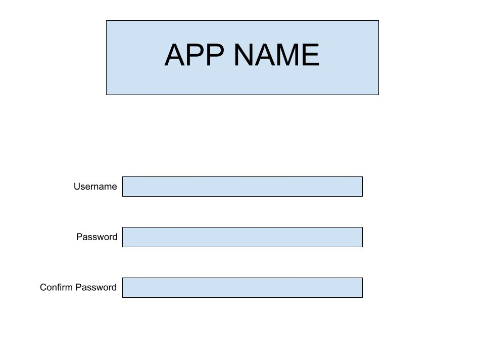
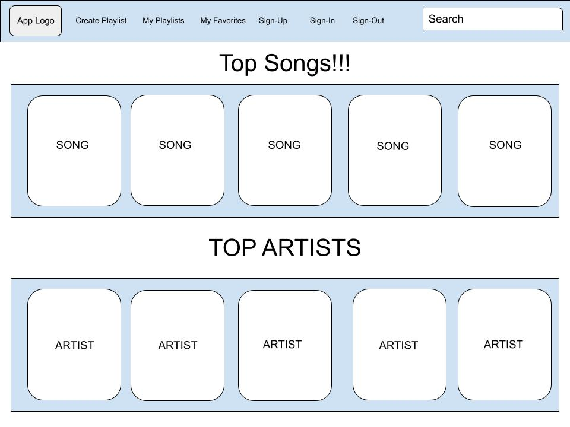
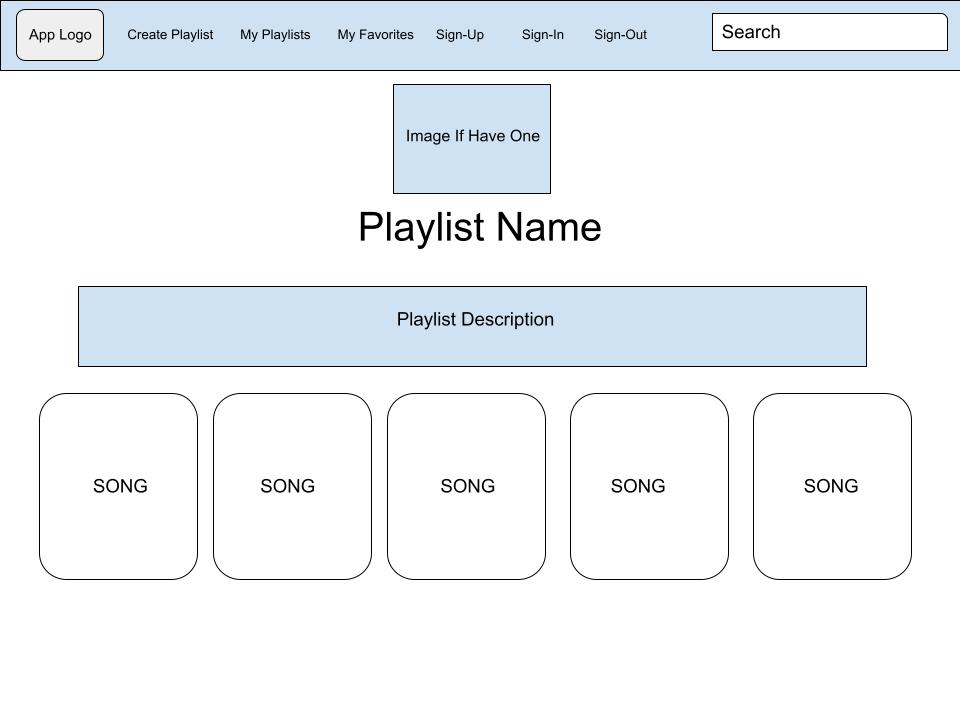

# Project 4
A platform to look up music, add songs to a playlist, favorite a song!

## Project 4 API
https://github.com/jlx012/project-4-api

## User Stories
#### Registered user
##### Sign in/out, account information routes
* As a registered user, I want to be able to sign in
* As a registered user, I want to be able to sign out
* As a registered user, I want to be able to change my password

##### All songs
* As a registered user, I expect to view a list of songs
* As a registered user, I expect to be able to click on a song and see more info
* As a registered user, I want to be able to search for a song or songs
* As a registered user, I want to be able to filter by genre

##### Favorite Songs
* As a registered user, I want to be able to be able to add songs to my favorite list

##### Playlists
* As a registered user, I want to be able to be able to create a playlist
* As a registered user, I want to be able to be able to delete a playlist
* As a registered user, I want to be able to be able to add and remove songs from a playlist

#### Unregistered user
* As a unregistered user, I want to be able to sign up/create account
* As a unregistered user, I expect to view a list of songs
* As a unregistered user, I expect to be able to click on a song and see more info and comments/reviews
* As a unregistered user, I want to be able to search for a song
* As a unregistered user, I want to be able to see the song club song

## Wireframes

## ERD

##### Stretch
* As a registered user, I want to be able to like a song and remove my like
* As a registered user, I want to be able to rate a song
* As a registered user, I want to be able to be able create and delete a song
* As a registered user, I want to be able to follow an artist
